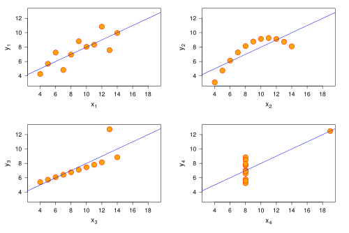

# Universidad Politécnica Salesiana

**Carrera:** Ingeniería en Ciencias de la Computación  
**Periodo:** 2025  
**Estudiante:** Franklin Guapisaca  

---

## Introducción teórica al Cuarteto de Anscombe

El Cuarteto de Anscombe es un conjunto compuesto por cuatro series de datos que, aunque presentan diferencias notables al ser graficadas, comparten características estadísticas esenciales como la media, la varianza, el coeficiente de correlación y la recta de regresión lineal. Este conjunto fue ideado por el estadístico Francis Anscombe en 1973 con el objetivo de subrayar la importancia de la visualización de los datos antes de llevar a cabo un análisis estadístico, mostrando cómo los datos numéricos, por sí solos, pueden ser engañosos.

El objetivo principal de este cuarteto es resaltar que el análisis estadístico no debe apoyarse únicamente en medidas resumidas. Sirve como una advertencia frente a una confianza excesiva en los resultados numéricos y destaca la relevancia de examinar gráficamente los datos para descubrir patrones, identificar valores atípicos o detectar relaciones no lineales que podrían no ser evidentes mediante técnicas estadísticas convencionales. Esto contribuye a lograr interpretaciones más precisas y significativas.

---

## Visualización

---

## Bibliografía

Gupta, S. (2022). *Anscombe's Quartet: What Is It and Why Do We Need It?* Built In. Recuperado de: [https://builtin.com/data-science/anscombes-quartet](https://builtin.com/data-science/anscombes-quartet)

